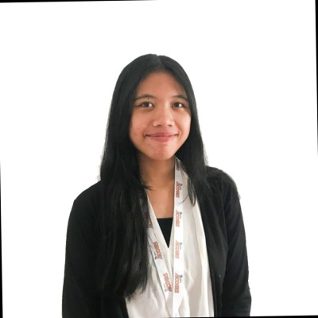
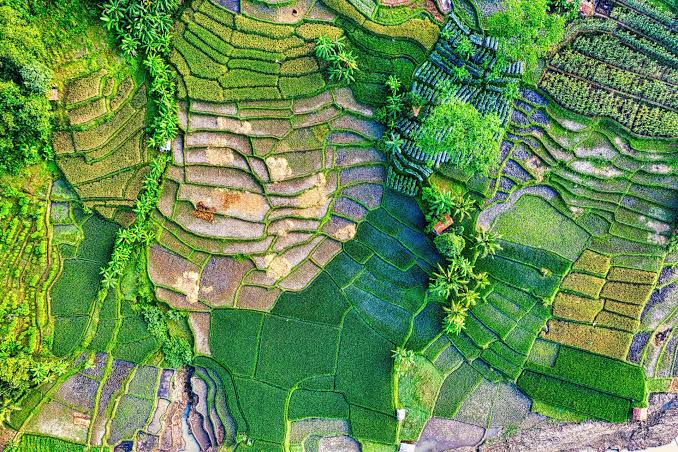

---
hide:
  - toc
  - navigation
---
<!--
CHECKLIST FOR THIS PAGE:
- [ ] Replace [YOUR NAME] with your full name (3 places)
- [ ] Replace [YOUR JOB TITLE] with your current or target role
- [ ] Replace [YOUR TAGLINE] with a short phrase describing your focus
- [ ] Rewrite the About Me paragraph with your own words
- [ ] Replace assets/images/profile.png with your actual photo (keep the filename or update it below)
- [ ] Replace assets/images/about.png with your own image (a field photo, map, or workspace shot)
- [ ] Edit the skill cards to match your actual skills (add, remove, or rename cards as needed)
- [ ] Update GitHub and LinkedIn links in the Connect section
- [ ] Add your CV PDF to docs/assets/ and update the filename in the Download CV button
-->

  
  <h1>Retno Dammayatri</h1>
  
<strong>GIS & Remote Sensing Analyst</strong>

  
<em>Turning complex geospatial data into clear spatial insight | GIS | Remote Sensing | LiDAR</em>

---

## About Me

My journey into GIS began with a fascination for how location and spatial relationships help us understand the world around us. With a background in Geodesy and Geomatics Engineering, I developed a strong foundation in spatial data, remote sensing, and geospatial technologies — combining technical precision with a practical approach to analysing, managing, and visualising geographic information.

I have experience transforming complex spatial datasets into meaningful insights — from designing data collection workflows and managing geospatial databases to developing dashboards, analysing spatial information, and creating clear documentation to support decision-making. I enjoy solving spatial challenges, improving data quality, and building efficient workflows that bridge technical analysis with practical outcomes.

Originally from Indonesia, currently based in Brisbane, Australia on Work and Holiday Visa (subclass 462), I am passionate about applying GIS and remote sensing to spatial intelligence, data management, and geospatial problem-solving. I bring analytical rigour, curiosity, and a commitment to delivering accurate, impactful geospatial solutions.

  

---

[View My Projects :material-arrow-right:](projects/index.md){ .md-button .md-button--primary }
[Download CV :material-download:](assets/Retno-CV.pdf){ .md-button }

---

## Skills

-   :material-layers:{ .lg .middle } **GIS and Spatial**

    ---

    - QGIS, ArcGIS Pro, Google Earth Engine
    - Land Use / Land Cover (LULC) Mapping
    - Spatial Analysis & Suitability Mapping
    - Raster & Vector Geoprocessing
    - WebGIS, Cartography & Map Layout Design

-   :material-satellite-variant:{ .lg .middle } **Remote Sensing**

    ---

    - Satellite imagery pre-processing (Radiometric Correction, Geometric Correction)
    - Spectral Indiches e.g NDVI, NDBI, NDBaI, EVI etc.
    - Supervised & Unsupervised Classification
    - DSM & DTM Production
    

-   :material-star-four-points:{ .lg .middle } **LiDAR Data Processing**

    ---

    - Data and Trajectory Extraction
    - Point Cloud Classification / Post Processing
    - Strip Adjustment
    - Map Digitizing and Visualization

-   :material-airplane:{ .lg .middle } **Photogrammetry / UAV Data Processing**

    - Mission planning and flight operations
    - GNSS PPK/Trajectory Processing
    - Data Processing (Orthophoto, DTM, DSM)
    - Photogrammetry Software: Agisoft Metashape, PIX4D

-   :material-earth:{ .lg .middle } **Web & Cloud**

    ---

    - ArcGIS Online
    - Storymaps
    - ArcGIS Dashboard
    - QGIS2Web
    - PyQGIS
    - Leaflet.js, Folium, MapLibre GL JS

-   :material-database:{ .lg .middle } **Geospatial Intelligence**

    ---

    - Imagery Intelligence (IMINT)
    - Open Source Intelligence (OSINT)

---

## Connect

[GitHub](https://github.com/Dammayatri26){ .md-button }
[LinkedIn](https://linkedin.com/in/retnodammayatri/){ .md-button }
