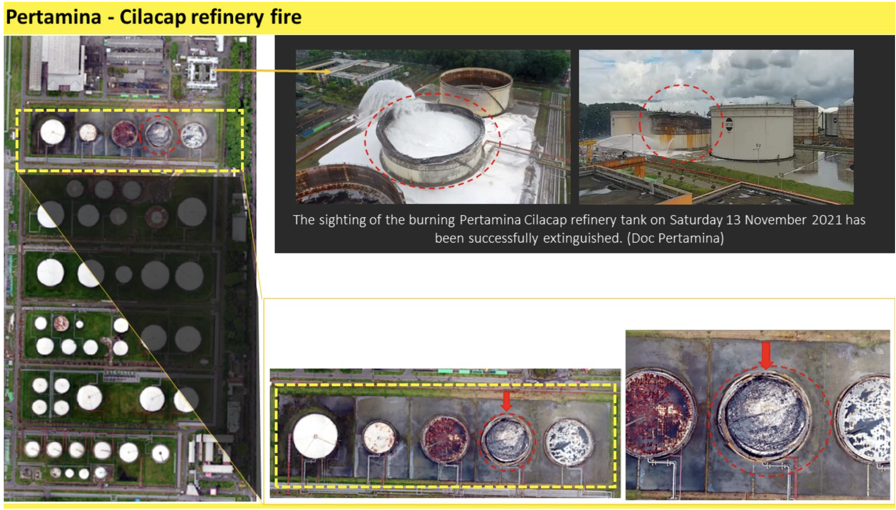
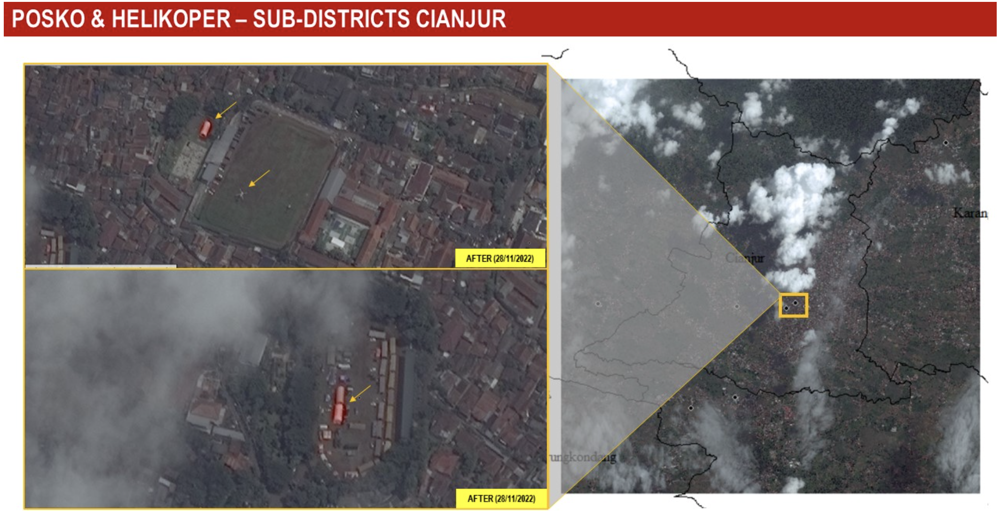

---
hide:
  - toc
  - navigation
---
<!--
CHECKLIST FOR THIS PAGE:
- [ ] Replace the two placeholder cards (marked [YOUR PROJECT ...]) with your real projects
- [ ] For each project: add a thumbnail image to docs/assets/images/ and update the path below
- [ ] For each project: create a project page by copying sample-project.md
- [ ] For each project: add a nav entry in mkdocs.yml (see the comments there)
- [ ] Delete placeholder cards you don't need yet
-->

# Geospatial Intelligence

A selection of my geospatial intelligence analysis projects. Click any card to see the full write-up.

**[Nusakambangan Case](https://sites.google.com/view/retno-portfolio/nusakambangan-case)**

As determined by the government, Nusakambangan Island is not intended to be inhabited by civilians — it can only be inhabited by prisoners, prison officials, and their families. However, there have been reports suggesting that parts of the island have been converted for other uses. This study used satellite imagery and Open Source Intelligence (OSINT) to investigate, applying visual analysis of high-resolution satellite imagery for time-series observation and spatial analysis.

[View Result →](https://sites.google.com/view/retno-portfolio/nusakambangan-case){ .md-button }

**[Pertamina Cilacap Case](https://sites.google.com/view/retno-portfolio/pertamina-cilacap-case)**

On November 13, 2021, a fire occurred in tank 36 T-102 at the Pertamina Cilacap refinery. This study analyzed the incident before and after using satellite imagery (before) and drone-acquired imagery (after) to assess the impact.

[View Result →](https://sites.google.com/view/retno-portfolio/pertamina-cilacap-case){ .md-button }

**[Cianjur Earthquake Case](https://sites.google.com/view/retno-portfolio/cianjur-case)**

On November 21, 2022, a Mw 5.6 earthquake struck the Cianjur area, West Java. This study used archive and newest satellite imagery from Maxar (SecureWatch) to assess change and impact.

[View Result →](https://sites.google.com/view/retno-portfolio/cianjur-case){ .md-button }

