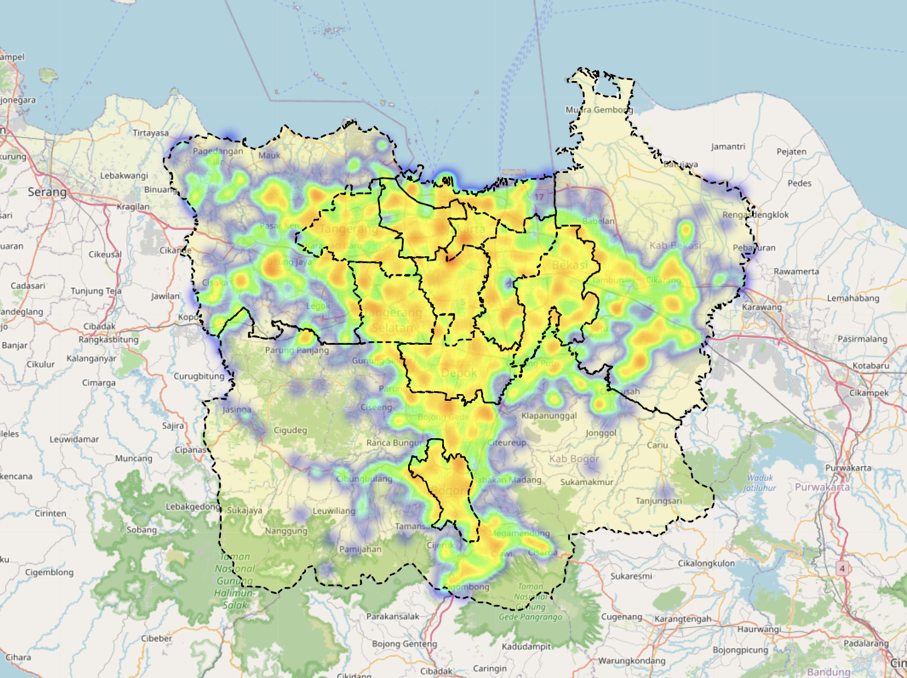
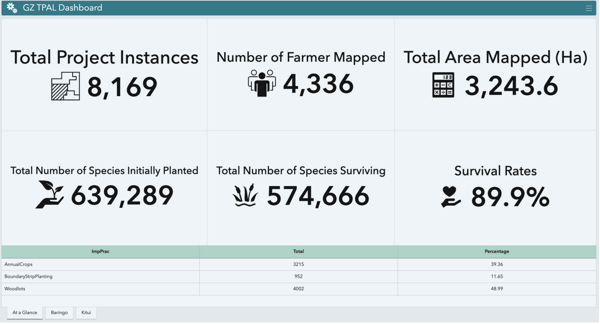
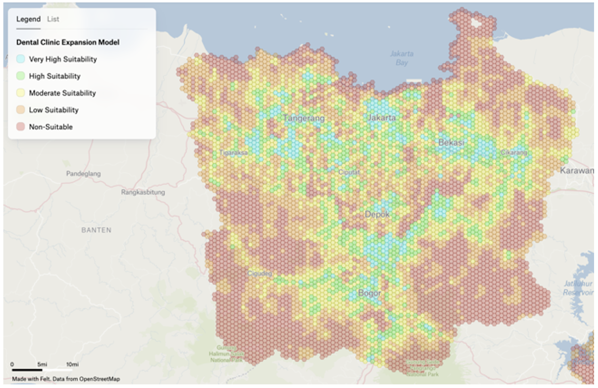
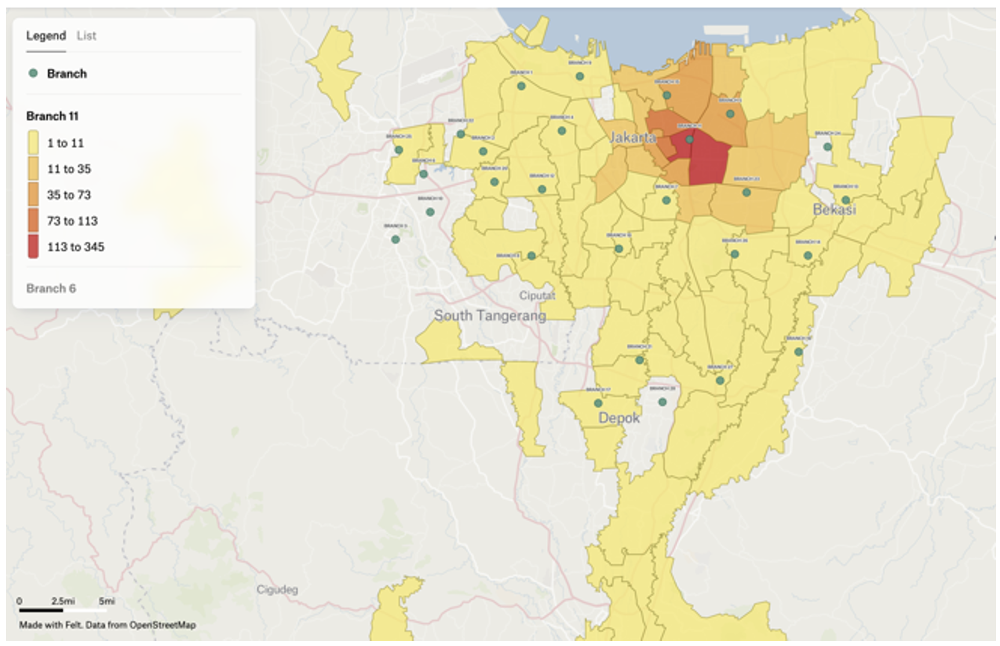

---
hide:
  - toc
  - navigation
---
<!--
CHECKLIST FOR THIS PAGE:
- [ ] Replace the two placeholder cards (marked [YOUR PROJECT ...]) with your real projects
- [ ] For each project: add a thumbnail image to docs/assets/images/ and update the path below
- [ ] For each project: create a project page by copying sample-project.md
- [ ] For each project: add a nav entry in mkdocs.yml (see the comments there)
- [ ] Delete placeholder cards you don't need yet
-->

# GIS and Spatial

A selection of my remote sensing projects. Click any card to see the full write-up.

**[Food and Beverages Heatmap Analysis and Population Density for Starbucks Coffe Expansion Using Python](https://colab.research.google.com/drive/1JLaT-5TaQW8vMFhGgMnMiRZEaoLMf0VL?usp=sharing)**

Analyzed population density and food & beverage points of interest across a hexagonal grid using Python to identify potential Starbucks expansion locations. The final output overlays a population density hexagon map with a heatmap of nearby F&B points of interest, highlighting areas with strong demographic and market demand.

`[Python]` `[Hexagon]` `[Heatmap]`

[View Script and WebGIS](https://colab.research.google.com/drive/1JLaT-5TaQW8vMFhGgMnMiRZEaoLMf0VL?usp=sharing){ .md-button }

**[Restore Africa Project Monitoring Dashboard](gis-dashboard.md)**

Interactive dashboard to track landscape restoration activities, spatial coverage, and key monitoring indicators, giving the team and stakeholders real-time visibility into project progress.

`[ArcGIS Pro]` `[ArcGIS Online]` `[ArcGIS Dashboard]` `[ArcGIS Field Maps]`

[View Project →](gis-dashboard.md){ .md-button }

**[Restore Africa Eligibility Mapping Assessment](gis-eligibility.md)**

Combined satellite imagery interpretation with spatial overlay analysis in ArcGIS Pro to identify areas eligible for landscape restoration and carbon project interventions across Africa, supporting site selection aligned with program eligibility requirements.

`[ArcGIS Pro]` `[QGIS]` `[Google Earth]` `[Global Mapper]`

[View Project →](gis-eligibility.md){ .md-button }

**[Dental Clinic Expansion Analysis Using Spatial Analysis and Hexagon](gis-jabodetabek.md)**

Used spatial analysis and a hexagonal grid framework to evaluate population density, competitor locations, and demographic demand for potential dental clinic expansion sites, pinpointing areas with strong market opportunity and limited existing coverage.

`[ArcGIS Pro]` `[QGIS]` `[Felt]` 

[View Project →](gis-jabodetabek.md){ .md-button }

**[Mapping Costumer Pattern and Distribution](gis-geocode.md)**

Geocoded patient address data into spatial format using the Google Maps API to map patient distribution patterns. The resulting insights supported marketing and expansion planning for other departments.

`[Google Maps API]` `[ArcGIS Pro]` `[Felt]` 

[View Project →](gis-geocode.md){ .md-button }

