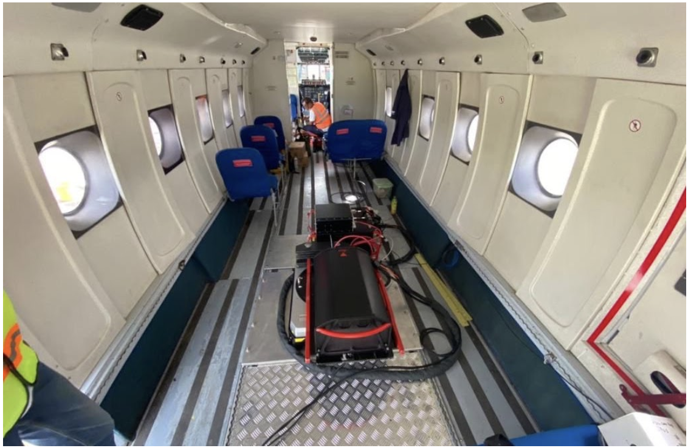
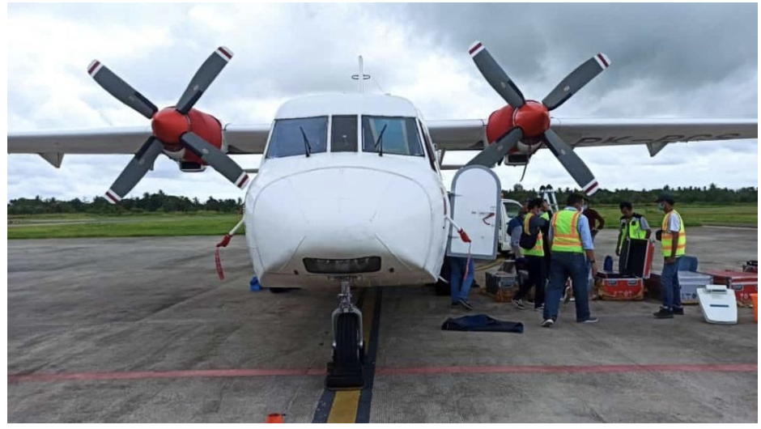
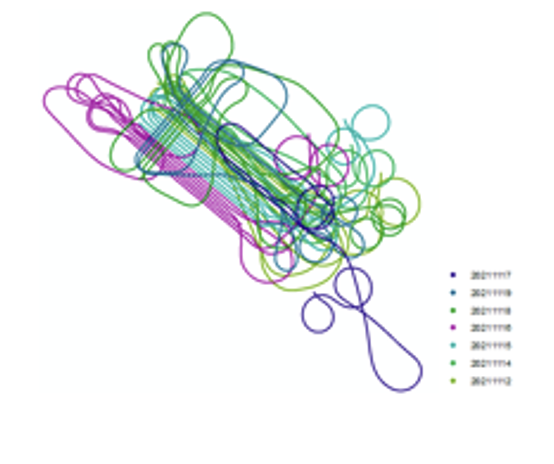
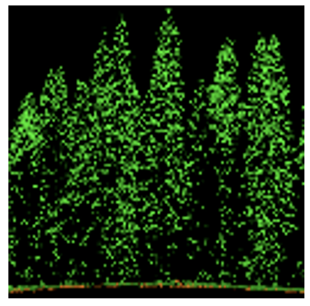
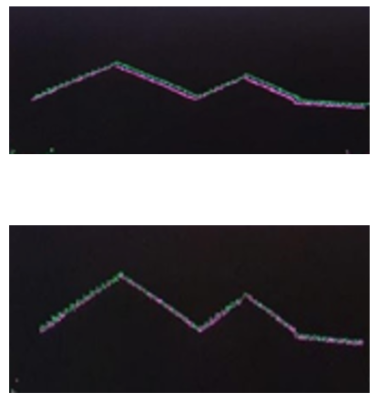
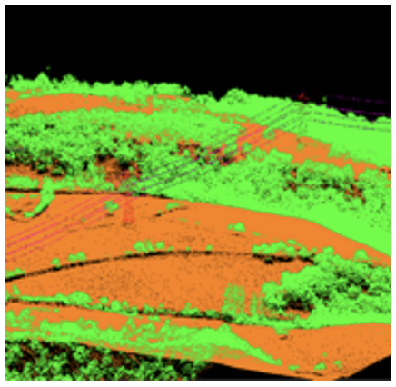
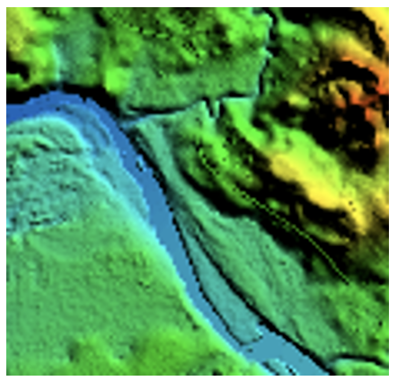
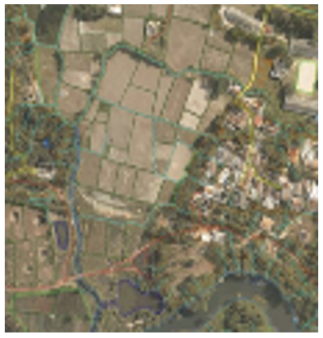

# LiDAR Data Processing

## Overview

Processed airborne LiDAR and photogrammetry data — from raw trajectory and point cloud extraction through to classified elevation models and topographic map layouts — supporting multiple dam, irrigation, and lake topographic survey projects across Indonesia.

**Study Area:** Multiple sites across Indonesia (Papua, South Sulawesi, West Sumatera)  
**Role:** GIS & Remote Sensing Analyst 
**Status:** Completed 

---
## Data Acquisition

LiDAR and airborne data acquisition is using Leica ALS80 and CASA aircraft.

| { style="width:100%; height:220px; object-fit:cover; border-radius:6px;" } | { style="width:100%; height:220px; object-fit:cover; border-radius:6px;" } |
|:---:|:---:|
| **Leica ALS80** | **CASA Aircraft** |

---

## Methods & Tools

**Data Sources**

- Airborne LiDAR sensor data
- GNSS/trajectory data for georeferencing
- Aerial photogrammetry imagery

**Processing Steps**

**Pre-Processing**

| { style="width:100%; height:180px; object-fit:cover; border-radius:6px;" } | { style="width:100%; height:180px; object-fit:cover; border-radius:6px;" } | { style="width:100%; height:180px; object-fit:cover; border-radius:6px;" } |
|:---:|:---:|:---:|
| **1. Trajectory Processing** | **2. Raw Data Extraction** | **3. Strip Adjustment** |
| Trajectory is used to reference laser and photo coordinates to ground coordinates according to BM references. | Converted from LiDAR sensor format to point cloud. | Strip adjustment is done to make corrections between paths, using TerraMatch. |

**Post-Processing**

| { style="width:100%; height:180px; object-fit:cover; border-radius:6px;" } | { style="width:100%; height:180px; object-fit:cover; border-radius:6px;" } | { style="width:100%; height:180px; object-fit:cover; border-radius:6px;" } |
|:---:|:---:|:---:|
| **1. Point Cloud Classification** | **2. Elevation Modelling** | **3. Digitizing & Layouting** |
| Classified point cloud data into classes: ground and non-ground (vegetation, buildings, water, and noise). | Converted the classified data into Digital Elevation Models (DTM & DSM). | Digitizing and layouting into topographic map. |

**Tools Used**

| Tool | Purpose |
|------|---------|
| NovAtel Inertial Explorer, Leica HxMap | Trajectory and data extraction |
| TerraSolid, MicroStation | Point cloud classification and post-processing |
| TerraMatch | Strip adjustment |
| ArcGIS, Global Mapper | Map digitizing and visualization |
| Leica HxMap | Photogrammetry processing |
| Emlid Studio, RTKLIB | GNSS PPK/trajectory processing |

---
## Key Findings

Delivered airborne LiDAR topographic surveys and mapping for the following projects:

- **Topographic Survey and Mapping for the Development of Digoel Multipurpose Dam** — Digoel, South Papua, Indonesia | Jul 2021 | [View Sample](https://sites.google.com/view/retno-portfolio/digoel)
- **Topographic Survey and Mapping for the Development of Rongkong Multipurpose Dam** — Luwu, South Sulawesi, Indonesia | Jan 2022 | [View Sample](https://sites.google.com/view/retno-portfolio/rongkong)
- **Topographic Survey and Mapping for the Development of Warsamson Multipurpose Dam** — Sorong, West Papua, Indonesia | Jul 2021 | [View Sample](https://sites.google.com/view/retno-portfolio/warsamson)
- **Lake Maninjau Topographic Survey and Mapping** — Lake Maninjau, West Sumatera, Indonesia | Jun 2021 | [View Sample](https://sites.google.com/view/retno-portfolio/merauke)
- **Topographic Survey and Mapping for the Development of The Merauke Irrigation System** — Merauke, South Papua, Indonesia | Feb 2021 | [View Sample](https://sites.google.com/view/retno-portfolio/digoel)
