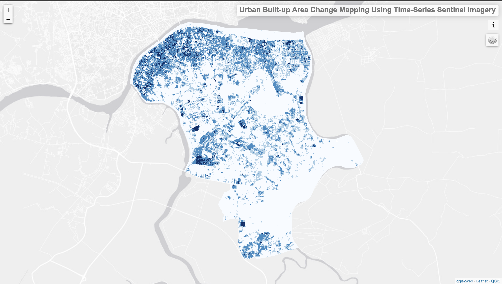
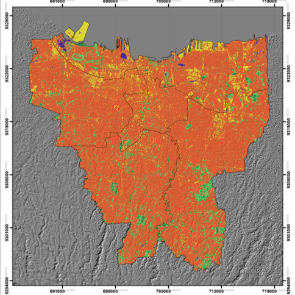

---
hide:
  - toc
  - navigation
---
<!--
CHECKLIST FOR THIS PAGE:
- [ ] Replace the two placeholder cards (marked [YOUR PROJECT ...]) with your real projects
- [ ] For each project: add a thumbnail image to docs/assets/images/ and update the path below
- [ ] For each project: create a project page by copying sample-project.md
- [ ] For each project: add a nav entry in mkdocs.yml (see the comments there)
- [ ] Delete placeholder cards you don't need yet
-->

# Remote Sensing

A selection of my remote sensing projects. Click any card to see the full write-up.

**[Muara Gembong Mangrove Extent](rs-muaragembong.md)**

A remote sensing project that I have done using Google Earth Engine to monitor mangrove loss over time. The analysis used Landsat imagery from 2000, 2010, and 2020 and applied Random Forest Classification to map and assess changes in mangrove extent.

`[GEE]` `[Random Forest Classification]` 

[View Project →](rs-muaragembong.md){ .md-button }

**[DSM & DTM Generation From Stereo Pair High-Resolution Satellite Imagery](rs-dsm.md)**

Projects that I have done include generating DSM and DTM from 50 cm WorldView-3 stereo imagery for Lake Toba, Indonesia. The project used ERDAS Imagine for stereo processing and triangulation, and PCI Geomatica for terrain extraction and surface-object removal.

`[ERDAS Imagine]` `[PCI Geomatica]` `[WorldView-3]`

[View Project →](rs-dsm.md){ .md-button }

**[Urban Built-Up Area Change Mapping Using Time-Series Sentinel Imagery](rs-palembang.md)**

Investigating the impact of Trans Sumatera Toll Road Development in Seberang Ulu Area, Palembang, Indonesia Using Sentinel Imagery

`[WebGIS]` `[StoryMap]` `[ENVI]` `[ArcGIS Pro]`

[View Project →](rs-palembang.md){ .md-button }

**[Jakarta Green Open Space](rs-jkt.md)**

Projects that I have done include analyzing green open space changes in DKI Jakarta using Landsat 8 OLI/TIRS imagery from 2014, 2015, and 2019. The project used NDVI analysis in ENVI and ArcGIS Desktop to map GOS distribution and assess temporal changes in vegetation cover.

`[ENVI]` `[ArcGIS Pro]`

[View Project →](rs-jkt.md){ .md-button }

