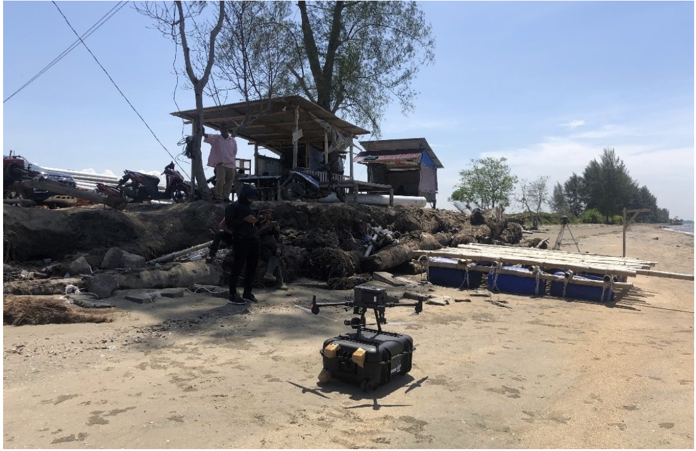
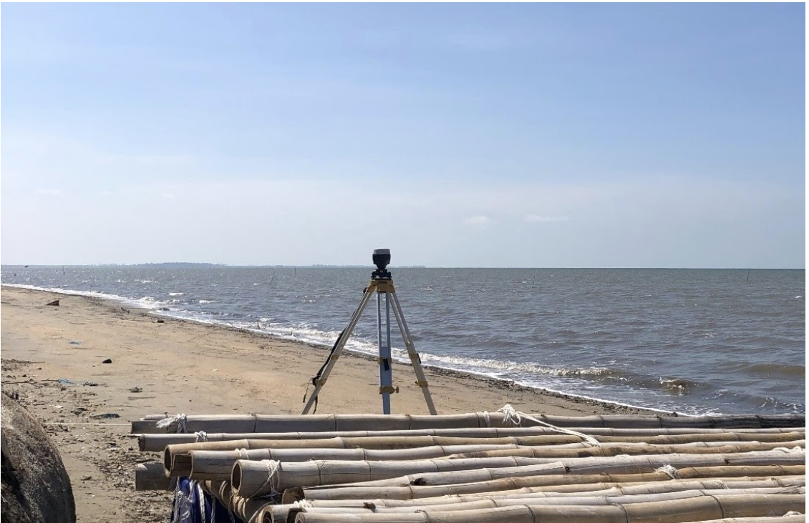
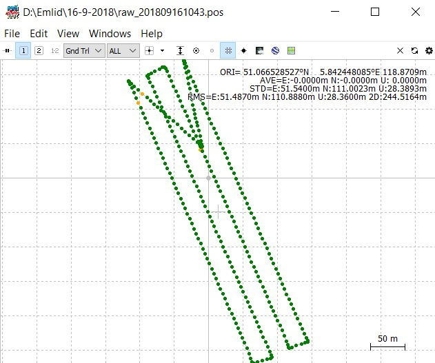
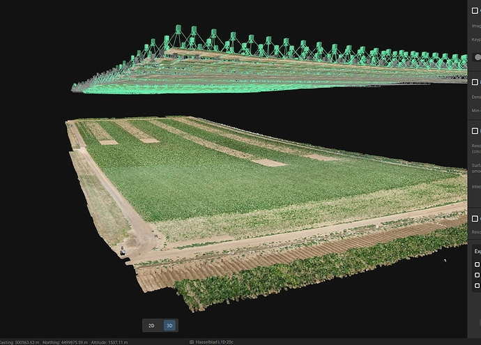
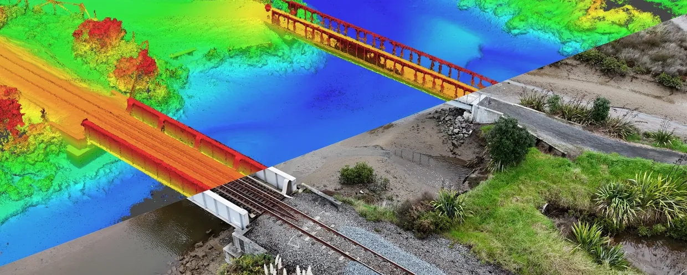

# Photogrammetry/UAV Data Processing

## Overview

Acquisition and processed UAV and aerial photogrammetry data — from flight planning, data extraction, GNSS PPK geotagging through orthophoto generation and elevation modeling — to deliver land mapping and administration surveys across Indonesia.

**Study Area:** Multiple sites across Indonesia (East Aceh, Southeast Sulawesi, South Kalimantan, West Java, Riau Islands)  
**Role:** GIS & Remote Sensing Analyst  
**Status:** Completed

---

## Data Acquisition

The acquisition data method in this project is using GNSS surveying, aerial survey using drone (DJI Matrice 300 RTK).

| { style="width:100%; height:220px; object-fit:cover; border-radius:6px;" } | { style="width:100%; height:220px; object-fit:cover; border-radius:6px;" } |
|:---:|:---:|
| **DJI Matrice 300 RTK** | **GNSS Surveying** |

---

## Methods & Tools

**Data Sources**

- UAV/aerial photography
- GNSS PPK positioning data

**Processing Steps**

| { style="width:100%; height:180px; object-fit:cover; border-radius:6px;" } | { style="width:100%; height:180px; object-fit:cover; border-radius:6px;" } | { style="width:100%; height:180px; object-fit:cover; border-radius:6px;" } |
|:---:|:---:|:---:|
| **1. GNSS PPK Data Processing** | **2. Aerial Photo Processing** | **3. Elevation Modelling** |
| To geotagged aerial photo data. | Processing from aerial photo to orthophoto using **Agisoft/Pix4D** software. | Digitizing and layouting into topographic map. |

**Tools Used**

| Tool | Purpose |
|------|---------|
| Emlid Studio, RTKLIB | GNSS PPK/trajectory processing |
| Agisoft Metashape, Pix4D | Aerial photo processing (orthophoto, 3D model) |
| ArcGIS, Global Mapper | Map digitizing and visualization |

---
## Key Findings

Delivered photogrammetry mapping surveys for the following projects:

- **Land Mapping for Integrated Shrimp Farming and Revitalization** — East Aceh, Southeast Sulawesi, and South Kalimantan | [View Sample](https://sites.google.com/view/retno-portfolio/east-aceh)
- **Aerial Survey and Mapping for Land Administration Maps** — Majalengka, West Java, Indonesia | [View Sample](https://sites.google.com/view/retno-portfolio/majalengka)
- **Aerial Survey and Mapping for Land Administration Maps** — Bintan, Riau Islands, Indonesia | [View Sample](https://sites.google.com/view/retno-portfolio/bintan)

