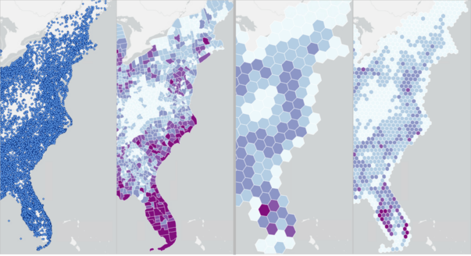
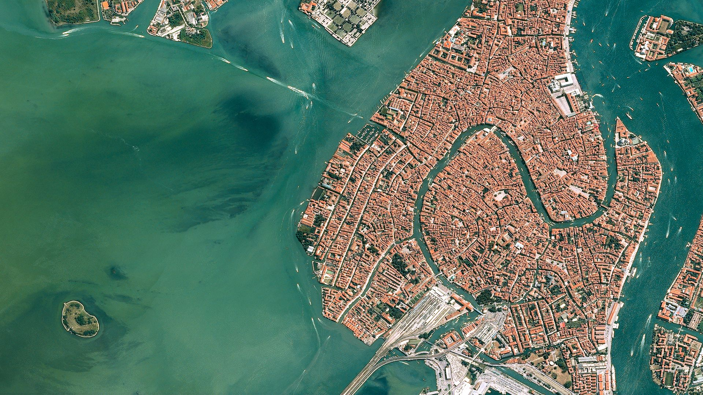
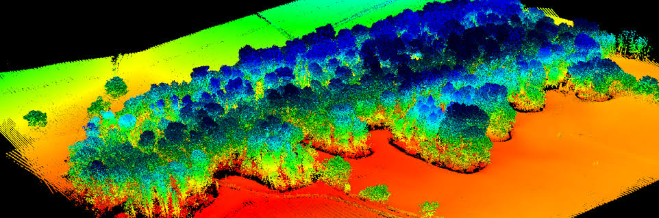
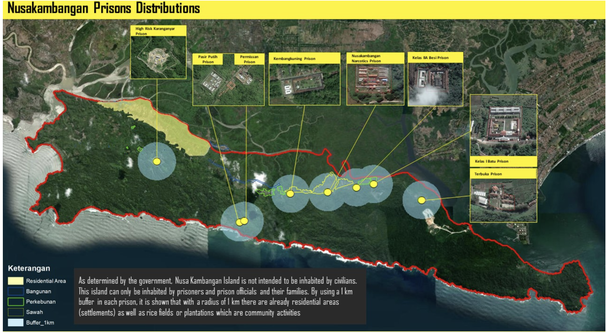

---
hide:
  - toc
  - navigation
---
<!--
CHECKLIST FOR THIS PAGE:
- [ ] Replace the two placeholder cards (marked [YOUR PROJECT ...]) with your real projects
- [ ] For each project: add a thumbnail image to docs/assets/images/ and update the path below
- [ ] For each project: create a project page by copying sample-project.md
- [ ] For each project: add a nav entry in mkdocs.yml (see the comments there)
- [ ] Delete placeholder cards you don't need yet
-->

# Projects

A selection of my geospatial projects. Click any card to see the full write-up.

**[GIS and Spatial](index-gis.md)**

Applied GIS and spatial analysis techniques — including site selection, spatial overlay, and hexagon-based modeling — to support data-driven decision-making across market, expansion, and land-use projects.

`[ArcGIS Pro]` `[QGIS]` `[Site Selection]` 

[View Project →](index-gis.md){ .md-button }

**[Remote Sensing](index-rs.md)**

Analyzed satellite imagery using remote sensing techniques to monitor land cover change, vegetation, and environmental indicators — turning raw imagery into actionable spatial insights for monitoring and reporting.

`[GEE]` `[ENVI]` `[ERDAS Imagine]` `[PCI Geomatica]`

[View Project →](index-rs.md){ .md-button }

**[LiDAR Data Processing](index-lidar.md)**

Processed airborne LiDAR and photogrammetry data — from raw trajectory extraction through classified elevation models — to deliver topographic surveys for multipurpose dam, irrigation, and lake mapping projects across Indonesia.

`[TerraSolid]` `[MicroStation]` `[TerraMatch]` 

[View Project →](index-lidar.md){ .md-button }

**[Photogrammetry / UAV Data Processing](index-uav.md)**

Processed UAV and aerial photogrammetry data — from GNSS PPK geotagging through orthophoto generation and elevation modeling — to deliver land mapping and administration surveys across Indonesia.

`[Agisoft Metashape]` `[Pix4D]` `[Emlid Studio,]` `[RTKLIB]` 

[View Project →](index-uav.md){ .md-button }

**[Geospatial Intelligence](index-gi.md)**

Applied imagery intelligence (IMINT), Open Source intelligence (OSINT), and spatial analysis to investigate real-world incidents.

`[Blaze Terra]` `[SecureWatch]` `[ArcGIS Pro]` 

[View Project →](index-gi.md){ .md-button }

