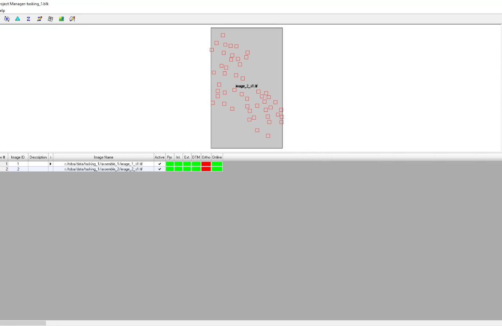
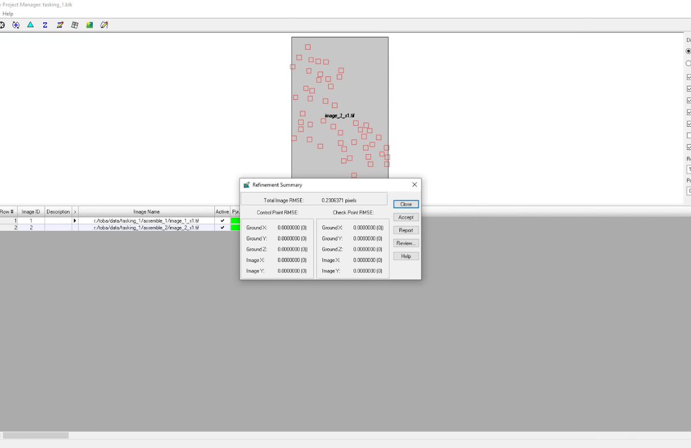
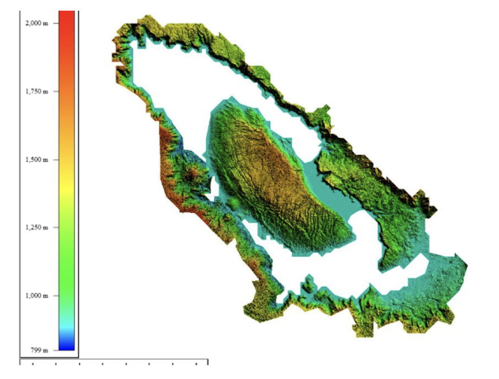

# DTM and DSM Generation from High-Resolution Stereo Satellite Imagery – Lake Toba

## Overview

This project generated a Digital Terrain Model (DTM) and Digital Surface Model (DSM) for the Lake Toba area, Indonesia, using high-resolution stereo satellite imagery — an efficient approach for producing elevation models over large areas.

**Study Area:** Lake Toba, Indonesia (208,500 Ha)
---

## Methods & Tools

**Data Sources**

- WorldView-3 high-resolution stereo pair satellite imagery (50 cm resolution)

**Processing Steps**

1. Acquired a stereo pair of WorldView-3 images (two images of the same area from different viewpoints) to enable 3D reconstruction.
2. Generated tie points between the two images in ERDAS Imagine.
3. Performed triangulation on the tie points to extract the Digital Surface Model (DSM).
4. Processed the DSM in PCI Geomatica to remove above-surface objects (e.g., buildings, vegetation) and produce the Digital Terrain Model (DTM).

**Tools Used**

| Tool | Purpose |
|------|---------|
| ERDAS Imagine | Tie point generation and triangulation for DSM extraction |
| PCI Geomatica | Filtering above-surface features to derive the DTM |
| WorldView-3 stereo imagery | Source 3D data for elevation modeling |

<!-- Replace with your "picture 1" -->

<!-- Replace with your "picture 2" -->

---
## Key Findings

- Produced a DTM and DSM covering the full 208,500 Ha Lake Toba study area from a single WorldView-3 stereo pair.
- Demonstrated that stereo satellite imagery is an efficient method for elevation modeling over large areas compared to ground-based surveying.
- [Add a specific finding, e.g. vertical accuracy, elevation range, or comparison to a reference DEM]

<!-- Replace with your DTM result image -->

---

