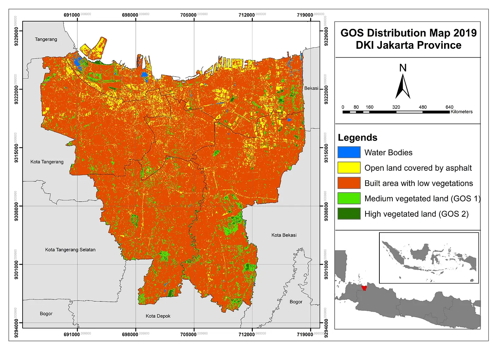

# Jakarta Green Open Space Analysis

## Overview

This project analyzed changes in Green Open Space (GOS) across DKI Jakarta Province in 2014, 2015, and 2019 to help understand the link between shrinking green open space, reduced water catchment area, and Jakarta's recurring flooding problems.

**Study Area:** DKI Jakarta Province, Indonesia

---

## Methods & Tools

**Data Sources**

- Landsat 8 OLI/TIRS imagery (Level L1TP), years 2014, 2015, and 2019

**Processing Steps**

1. Acquired Landsat 8 OLI/TIRS L1TP imagery for 2014, 2015, and 2019.
2. Calculated the Normalized Difference Vegetation Index (NDVI) for each year using ENVI and ArcGIS Desktop.
3. Classified the NDVI results into specific vegetation/green open space classes.
4. Produced green open space distribution maps for DKI Jakarta for each of the three years and compared them to identify change over time.

**Tools Used**

| Tool | Purpose |
|------|---------|
| ENVI | NDVI calculation from Landsat imagery |
| ArcGIS Desktop | NDVI classification and map production |
| Landsat 8 OLI/TIRS | Source satellite imagery for 2014, 2015, and 2019 |

<!-- Replace with your NDVI/methods image -->

---
## Key Findings

- Green open space area in DKI Jakarta declined across all three years studied (2014, 2015, 2019).
- Green open space dropped significantly by 2.9% between 2014 and 2015.
- Green open space declined by a further 0.8% between 2015 and 2019.

---

## Links

[View Article on Medium](https://medium.com/@dammayatri/optimization-of-green-open-space-and-bare-land-for-flood-control-analysis-in-dki-jakarta-fda27b364912){ .md-button }
