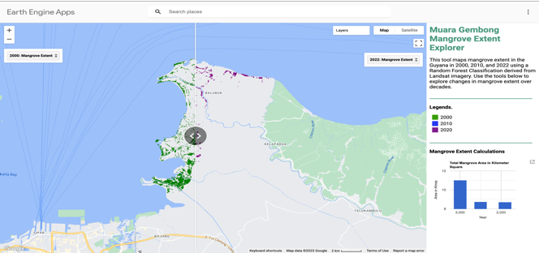

# Mangrove Loss Monitoring in Muaragembong Using Google Earth Engine

[View Google Earth Engine App](https://dammayatri.users.earthengine.app/view/geeappsguyanamangrovenasa){ .md-button }

## Overview

This project monitors mangrove cover change in Muaragembong over time, using Google Earth Engine (GEE) to identify areas of mangrove loss and gain and to better understand long-term trends in mangrove extent.

**Study Area:** Muaragembong, Bekasi, West Java, Indonesia <!-- confirm/replace if different -->

---

## Methods & Tools

**Data Sources**

- Landsat imagery for the years 2000, 2010, and 2020

**Processing Steps**

1. Acquired Landsat imagery for 2000, 2010, and 2020 in Google Earth Engine.
2. Calculated the Normalized Difference Vegetation Index (NDVI) for each time period, where higher NDVI values indicate higher levels of vegetation (mangroves).
3. Trained a Random Forest classifier using the NDVI-derived inputs to classify mangrove vs. non-mangrove cover for each year.
4. Compared classified outputs across the three time periods to identify areas of mangrove loss and gain.

**Tools Used**

| Tool | Purpose |
|------|---------|
| Google Earth Engine (GEE) | Image processing, NDVI calculation, and Random Forest classification |
| Landsat imagery | Source satellite data for 2000, 2010, and 2020 |
| Random Forest Classification | Classifying mangrove vs. non-mangrove areas from NDVI |

---
## Key Findings

- Produced a multi-temporal (2000, 2010, 2020) map of mangrove extent for the study area.
- Identified spatial patterns of mangrove loss and gain across the three time periods.
- Delivered results as an interactive Google Earth Engine App for public viewing.
